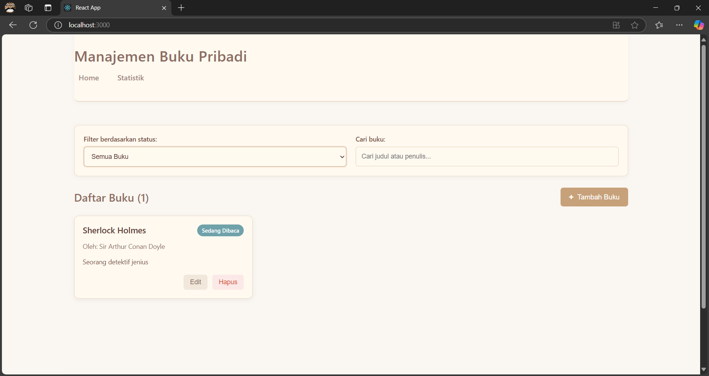
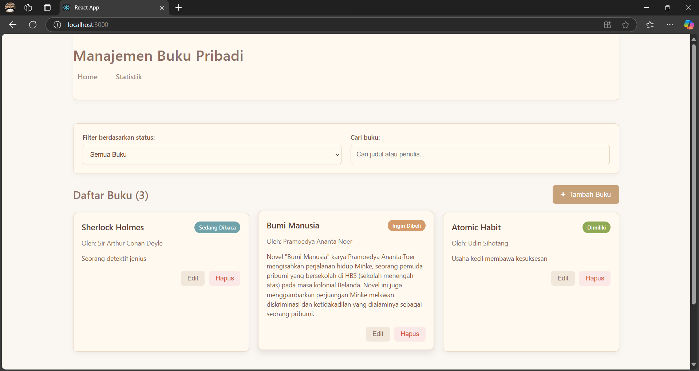
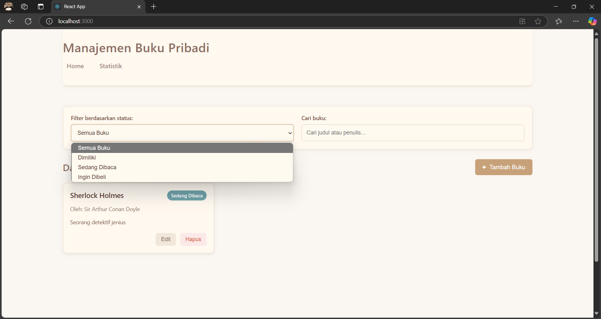
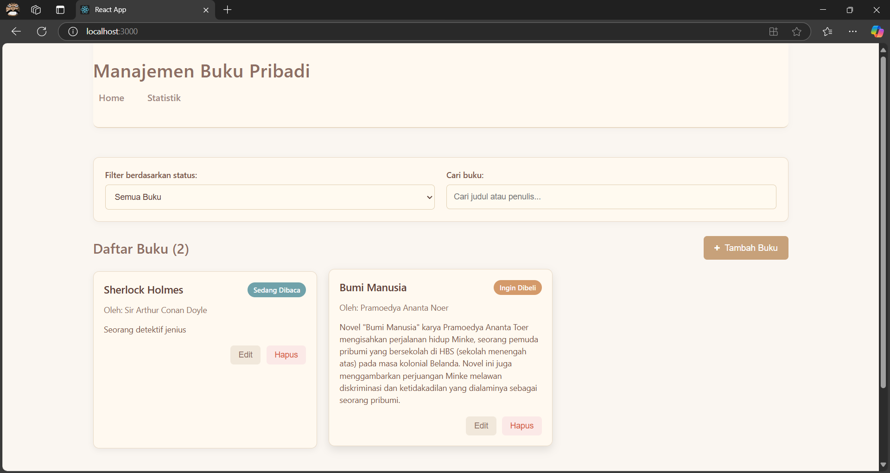
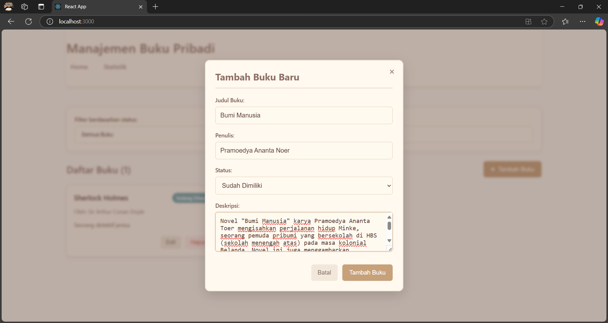
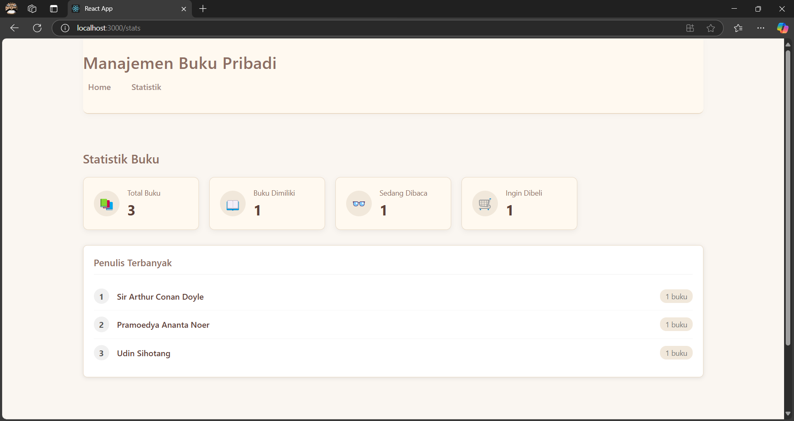
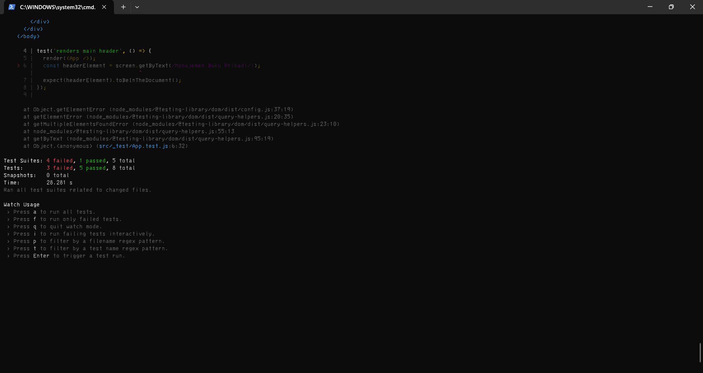

# Aplikasi Manajemen Buku Pribadi

Aplikasi ini memungkinkan pengguna untuk mencatat dan mengelola koleksi buku mereka, termasuk buku yang sudah dimiliki, sedang dibaca, atau ingin dibeli.

## Fitur Utama

- Menambah, mengedit, dan menghapus buku
- Memfilter buku berdasarkan status (dimiliki, sedang dibaca, ingin dibeli)
- Pencarian buku berdasarkan judul atau penulis
- Melihat statistik koleksi buku

## Teknologi yang Digunakan

- React.js dengan Functional Components
- React Hooks (`useState`, `useEffect`, `useContext`, `useMemo`)
- Context API untuk state management
- React Router untuk navigasi
- localStorage untuk penyimpanan data
- PropTypes untuk type checking
- React Testing Library untuk unit testing

## Instalasi

1. Clone repository ini
   ```
   git clone https://github.com/username/pertemuan3.git
   ```

2. Masuk ke direktori proyek
   ```
   cd pertemuan3
   ```

3. Install dependencies
   ```
   npm install
   ```

4. Jalankan aplikasi dalam mode development
   ```
   npm start
   ```

5. Buka [http://localhost:3000](http://localhost:3000) untuk melihat aplikasi di browser

## Struktur Aplikasi

```
src/
├── components/       # Komponen reusable
├── context/          # Context API untuk state management
├── hooks/            # Custom hooks
├── pages/            # Halaman aplikasi
├── __tests__/        # Unit tests
├── App.js            # Komponen utama
└── index.js          # Entry point
```

## Fitur React yang Digunakan

### Hooks
- **useState**: Digunakan untuk mengelola state lokal di komponen
- **useEffect**: Digunakan untuk efek samping seperti menyimpan data ke localStorage
- **useContext**: Digunakan untuk mengakses context di komponen
- **useMemo**: Digunakan untuk menghitung statistik buku

### Custom Hooks
- **useLocalStorage**: Hook untuk menyimpan dan mengambil data dari localStorage
- **useBookStats**: Hook untuk menghitung statistik buku

### Context API
- **BookContext**: Menyediakan state management untuk data buku di seluruh aplikasi

### React Router
- Digunakan untuk navigasi antar halaman (Home dan Stats)

## Screenshot Aplikasi

![Screenshot Halaman Utama]




![Screenshot Modal Tambah Buku]

![Screenshot Halaman Statistik]


## Laporan Testing

