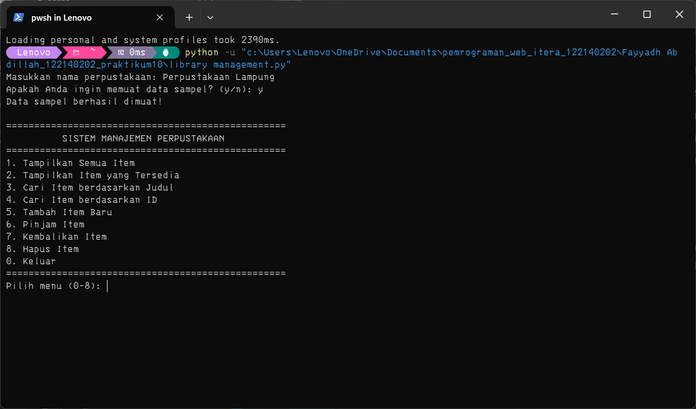
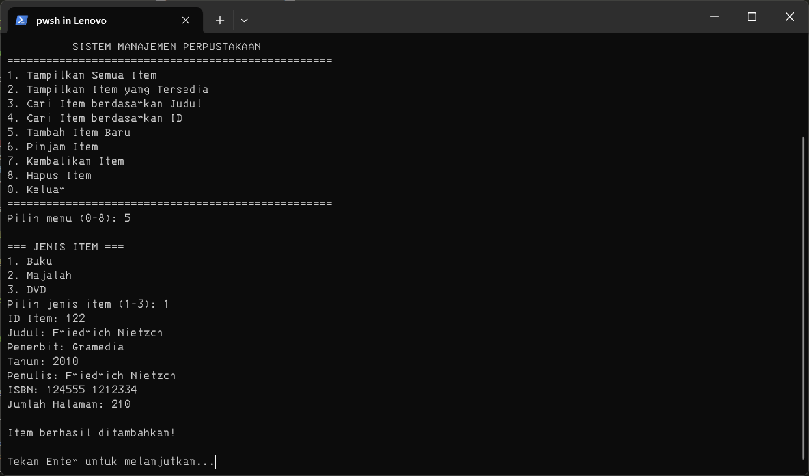
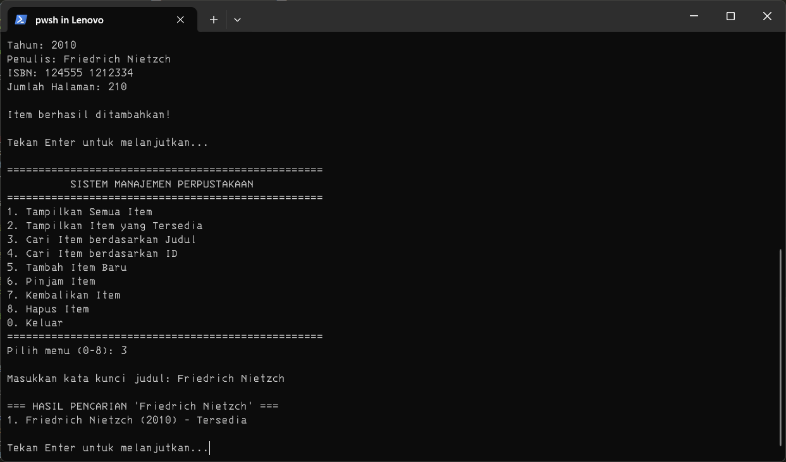
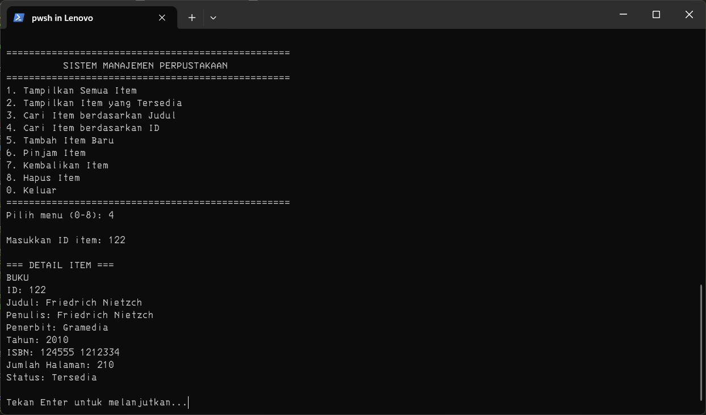
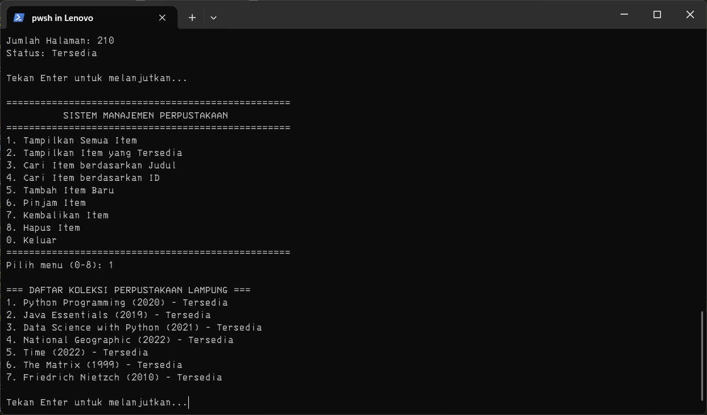
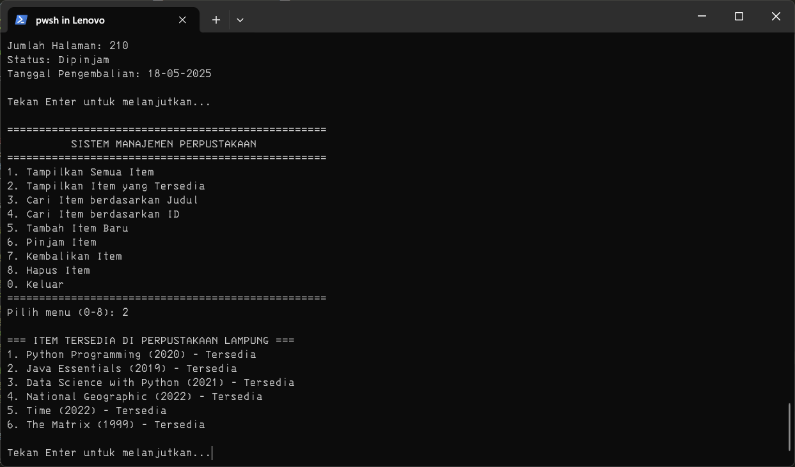
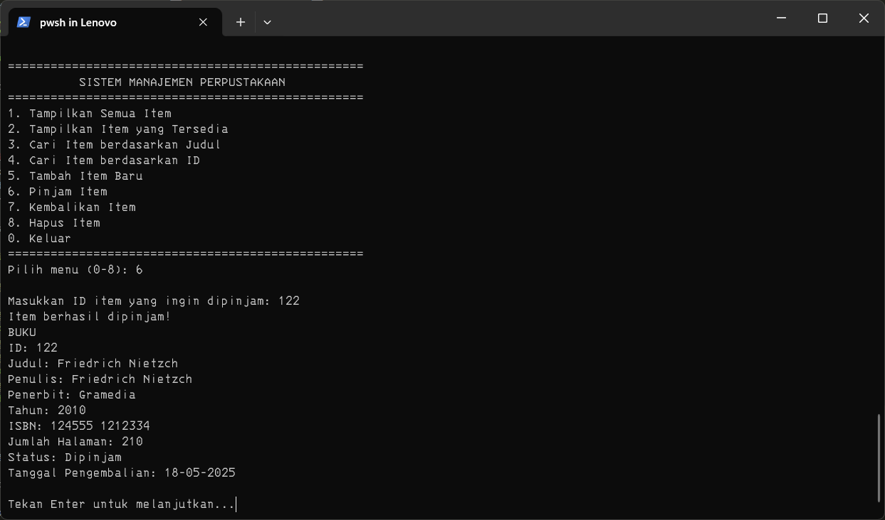
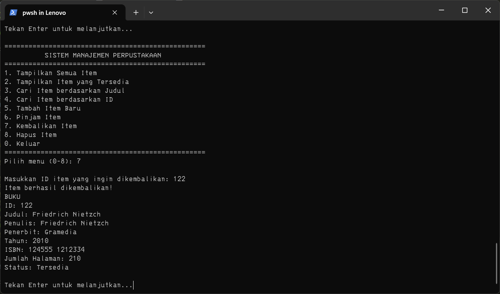

# Sistem Manajemen Perpustakaan

Proyek ini merupakan implementasi sistem manajemen perpustakaan sederhana menggunakan konsep pemrograman berorientasi objek (OOP) dalam bahasa Python. Sistem ini dikembangkan sebagai tugas untuk mendemonstrasikan pemahaman tentang konsep-konsep OOP seperti class, inheritance, encapsulation, dan polymorphism.

## Daftar Isi
- [Deskripsi](#deskripsi)
- [Fitur](#fitur)
- [Struktur Kode](#struktur-kode)
- [Konsep OOP yang Diterapkan](#konsep-oop-yang-diterapkan)
- [Cara Menggunakan](#cara-menggunakan)
- [Contoh Penggunaan](#contoh-penggunaan)
- [Screenshot Sistem](#screenshot-sistem)
- [Persyaratan](#persyaratan)
- [Pengembangan Lebih Lanjut](#pengembangan-lebih-lanjut)

## Deskripsi

Sistem Manajemen Perpustakaan ini memungkinkan pengguna untuk mengelola koleksi perpustakaan yang terdiri dari berbagai jenis item seperti buku, majalah, dan DVD. Pengguna dapat menambahkan item baru, mencari item berdasarkan judul atau ID, meminjam dan mengembalikan item, serta menampilkan daftar koleksi yang tersedia.

Program ini mengimplementasikan antarmuka command-line yang interaktif, memungkinkan pengguna untuk berinteraksi dengan sistem melalui menu yang mudah digunakan.

## Fitur

- Menambahkan item baru ke perpustakaan (buku, majalah, DVD)
- Menampilkan daftar semua item perpustakaan
- Menampilkan daftar item yang tersedia (tidak sedang dipinjam)
- Mencari item berdasarkan judul (pencarian sebagian)
- Mencari item berdasarkan ID
- Meminjam item dari perpustakaan
- Mengembalikan item ke perpustakaan
- Menghapus item dari koleksi
- Antarmuka command-line yang interaktif
- Validasi input pengguna
- Opsi untuk memuat data sampel

## Struktur Kode

Sistem ini terdiri dari beberapa class utama:

1. **LibraryItem (Abstract Class)**
   - Base class untuk semua item perpustakaan
   - Mendefinisikan atribut dan method dasar seperti ID, judul, status ketersediaan, dll.
   - Menyediakan method abstract yang harus diimplementasikan oleh subclass
   - Implementasi fungsi peminjaman dan pengembalian

2. **Book (Subclass dari LibraryItem)**
   - Merepresentasikan buku dengan atribut seperti penulis, ISBN, jumlah halaman

3. **Magazine (Subclass dari LibraryItem)**
   - Merepresentasikan majalah dengan atribut seperti nomor edisi dan kategori

4. **DVD (Subclass dari LibraryItem)**
   - Merepresentasikan DVD dengan atribut seperti sutradara, durasi, dan genre

5. **Library**
   - Mengelola koleksi item perpustakaan
   - Menyediakan method untuk menambah, mencari, meminjam, dan mengembalikan item

## Konsep OOP yang Diterapkan

### 1. Class dan Object
Sistem menggunakan berbagai class untuk merepresentasikan entitas dalam perpustakaan (Library, Book, Magazine, DVD).

### 2. Inheritance (Pewarisan)
- `Book`, `Magazine`, dan `DVD` mewarisi atribut dan method dari class `LibraryItem`
- Struktur inheritance memungkinkan kode yang lebih terorganisir dan menghindari duplikasi

### 3. Encapsulation (Enkapsulasi)
- Penggunaan access modifiers (`_` untuk protected, `__` untuk private) untuk melindungi data
- Method getter/setter yang mengontrol akses ke atribut
- Property decorator untuk mengakses atribut dengan aman

### 4. Polymorphism (Polimorfisme)
- Method `display_info()` diimplementasikan secara berbeda di tiap subclass
- Library dapat mengelola berbagai jenis item (buku, majalah, DVD) dengan cara yang seragam

### 5. Abstraction (Abstraksi)
- `LibraryItem` didefinisikan sebagai abstract class
- Method abstract `display_info()` harus diimplementasikan oleh semua subclass

## Cara Menggunakan

1. Pastikan Python 3.x terinstal di sistem Anda
2. Unduh file `library_system.py`
3. Jalankan program dengan perintah:
   ```
   python library_system.py
   ```
4. Ikuti instruksi di layar untuk berinteraksi dengan sistem

## Contoh Penggunaan

Berikut adalah contoh alur penggunaan sistem:

1. Saat memulai program, masukkan nama perpustakaan
2. Pilih apakah ingin memuat data sampel atau tidak
3. Gunakan menu untuk berinteraksi dengan sistem:
   - Tambahkan item baru dengan menu 5
   - Tampilkan koleksi dengan menu 1
   - Cari item dengan menu 3 atau 4
   - Pinjam item dengan menu 6
   - Kembalikan item dengan menu 7
   - Dan seterusnya

## Screenshot Sistem
### Menu Utama

### Menambahkan Item Baru

### Pencarian Item


### Tampilkan Koleksi


### Peminjaman dan Pengembalian



## Persyaratan
Program ini mengimplementasikan persyaratan berikut:

- [x] Abstract class `LibraryItem` yang menjadi dasar untuk semua item di perpustakaan
- [x] Minimal 2 subclass (`Book`, `Magazine`, dan `DVD`) yang mewarisi dari `LibraryItem`
- [x] Setiap subclass mengimplementasikan method abstract dari parent class
- [x] Class `Library` untuk menyimpan dan mengelola koleksi item perpustakaan
- [x] Encapsulation menggunakan access modifiers untuk melindungi data penting
- [x] Property decorator untuk minimal satu atribut (implementasi pada `duration` di class `DVD`)
- [x] Kemampuan menambahkan item ke perpustakaan
- [x] Kemampuan menampilkan daftar item yang tersedia
- [x] Kemampuan mencari item berdasarkan judul atau ID
- [x] Antarmuka interaktif untuk input pengguna
